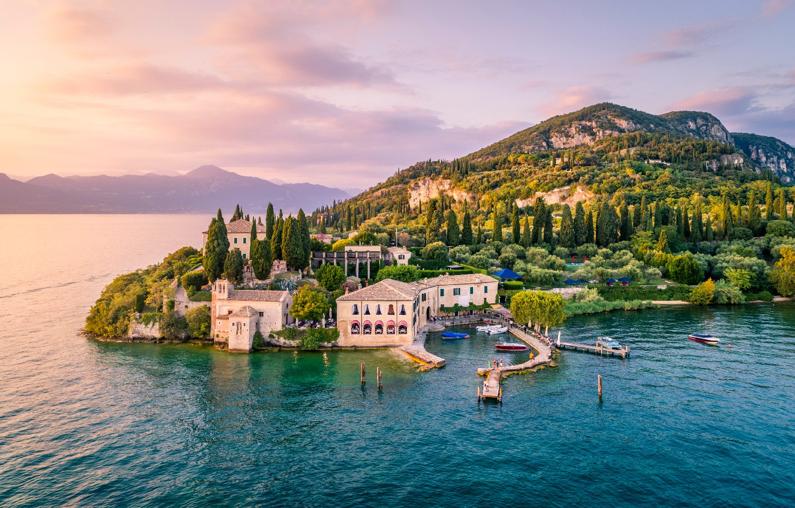

# Lago di Garda

Il **Lago di Garda** è il più grande lago italiano; di conseguenza è impensabile riuscire a scoprire tutte le cose da fare e da vedere in un’unica vacanza. Il segreto per scoprirle tutte è tornarci più volte in tutti i periodi dell’anno!

Ma la prima volta che venite in vacanza sul Lago di Garda non potete fare a meno di visitare questi luoghi iconici del territorio gardesano, che lo rappresentano nel mondo e non possono mancare nella vostra lista delle cose imperdibili.

